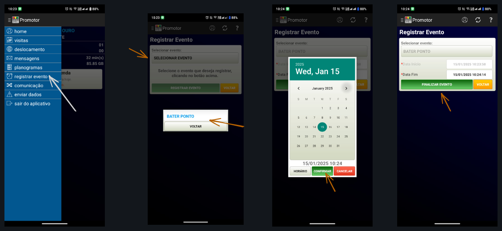
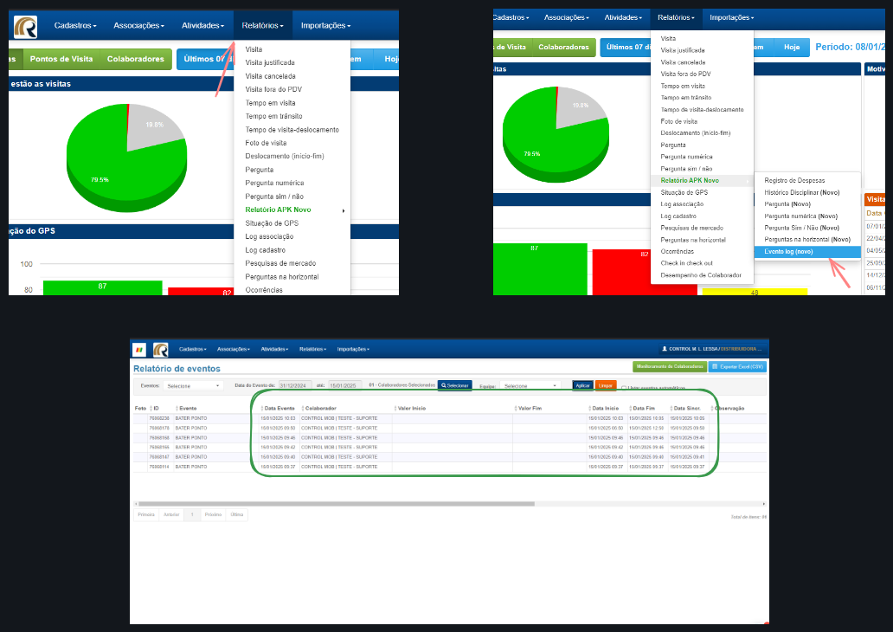
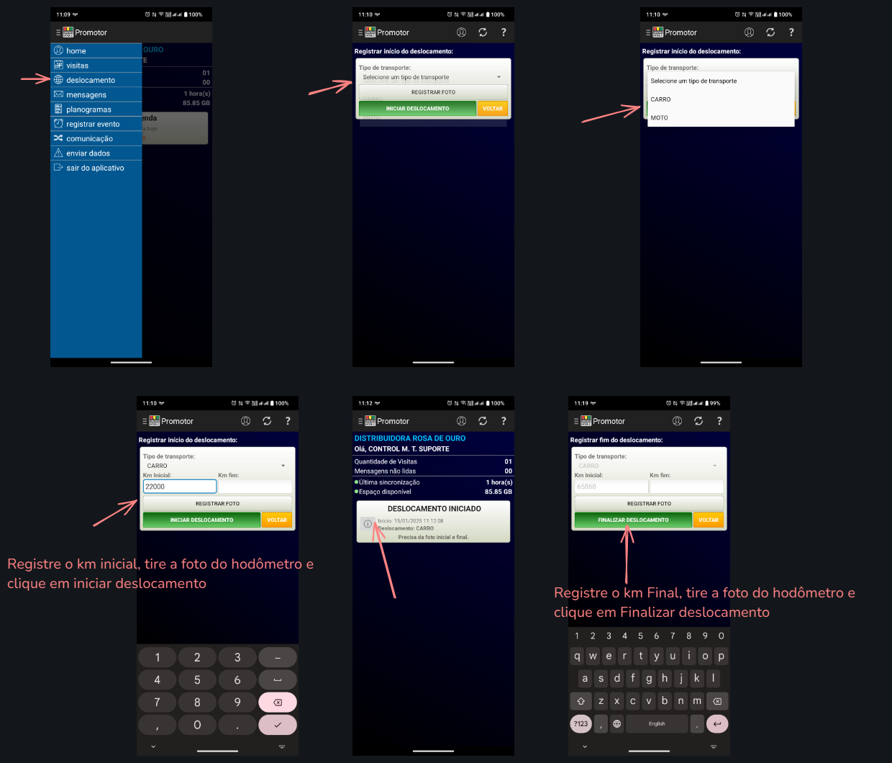
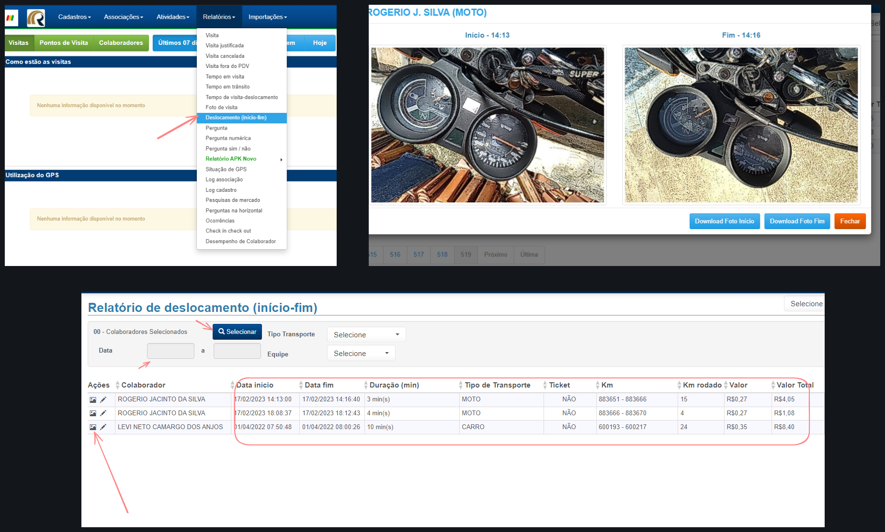

Sistema [[Colaboradores]]  #implantaçao

---
Briefing reunião [[2025-01-15]]

Apresentação das funções urgentes

- Bate ponto
- Deslocamento
---
#### Levantamento de Funcionalidades

- [x] Bate Ponto. ✅ 2025-01-15
- [ ] Deslocamento.
- [ ] Questionário vencimento.
- [ ] Questionário Share de gondola.
- [ ] Histórico disciplinar.

---
### Bate Ponto

##### Aplicativo

A funcionalidade bate ponto pode seguir o seguinte fluxo dentro do registro de eventos: 

| Passo                | Ação                             |
| -------------------- | -------------------------------- |
| 1. Acesso            | Acesse o aplicativo              |
| 2. Registrar Evento  | Clique para iniciar o registro   |
| 3. Selecionar Evento | Escolha "Bate-ponto"             |
| 4. Data Início       | Informe a data inicial           |
| 5. Confirmar         | Pressione o botão "Confirmar"    |
| 6. Iniciar Evento    | Clique em "Iniciar Evento"       |
| 7. Registrar Evento  | Realize as atividades planejadas |
| 8. Finalizar Evento  | Clique em "Finalizar Evento"     |
| 9. Data Fim          | Informe a data de término        |
| 10. Confirmar        | Pressione o botão "Confirmar"    |

Basicamente o promotor inicia o evento ao iniciar a jornada de trabalho logo, e finaliza o evento a terminar a mesma, sendo que e possível ele repetir esse processo duas vezes no dia para registrar o horário de almoço.

---
##### Sistema Web

Para verificar as atualizaçoes dos pontos pelo sistema web basta seguir o seguinte fluxo :

| Passo                       | Ação                                           |
| --------------------------- | ---------------------------------------------- |
| 1. Acesso                   | Acesse o Sistema web                           |
| 2. Relatorios               | Menu relatorio -> APK Novo                     |
| 3. Selecionar Log de Evento | Apk Novo -> Evento log (Novo)                  |
| 4. Data do evento           | Informe o periodo de data que deseja verificar |
| 5. Selecionar colaborador   | Pressione o botão "Aplicar"                    |

Dentro de relatórios de eventos, é possível realizar filtros mais específicos, incluindo eventos automáticos, para um maior controle da garantia dos dados. Também é possível selecionar o evento a ser analisado e gerar um relatório em Excel desse evento.

---
### Deslocamento

##### Aplicativo

A funcionalidade deslocamento segue o seguinte fluxo dentro do aplicativo:

| Passo                        | Ação                                                       |
| ---------------------------- | ---------------------------------------------------------- |
| 1. Acesso                    | Acesse o aplicativo                                        |
| 2. Registrar Deslocamento    | Clique para iniciar o registro                             |
| 3. Selecionar Veiculo        | Escolha o veiculo em uso                                   |
| 4. Km inicial                | Selecione o km inicial                                     |
| 5. Retirar foto comprovativa | Foto do hodômetro                                          |
| 6. Iniciar Deslocamento      | Clique em "Iniciar Deslocamento"                           |
| 7. Finalizar Deslocamento    | Insira km final, foto e clique em "Finalizar deslocamento" |

 

A função de deslocamento pode ser utilizada como alternativa para calcular  a quantidade de Km percorridos dentro de um percurso, é importante se atentar que essa função pode ser ativa apenas entre as visitas, afim de calcular o tempo e distancia de deslocamento de um PDV a outro.

--- 

#### Sistema Web

A funcionalidade relatório de deslocamento segue o seguinte fluxo dentro do sistema:

| Passo                 | Ação                                 |
| --------------------- | ------------------------------------ |
| 1. Acesso             | Acesse o Sistema                     |
| 2. Menu relatórios    | Clique em relatorio de deslocamento  |
| 3. Selecionar Filtros | Escolha os filtros para os dados     |
| 4. Verificar fotos    | Clique no ícone de fotos             |
| 5. Relatorios         | Utilize os botões "PDF" e ou "Excel" |

 

Nesta opção, é possível realizar algumas verificações, como a data de início, data de fim, quantidade de quilômetros rodados e valor total de gasto, considerando o valor inserido no cadastro do veículo em "custo por KM".
